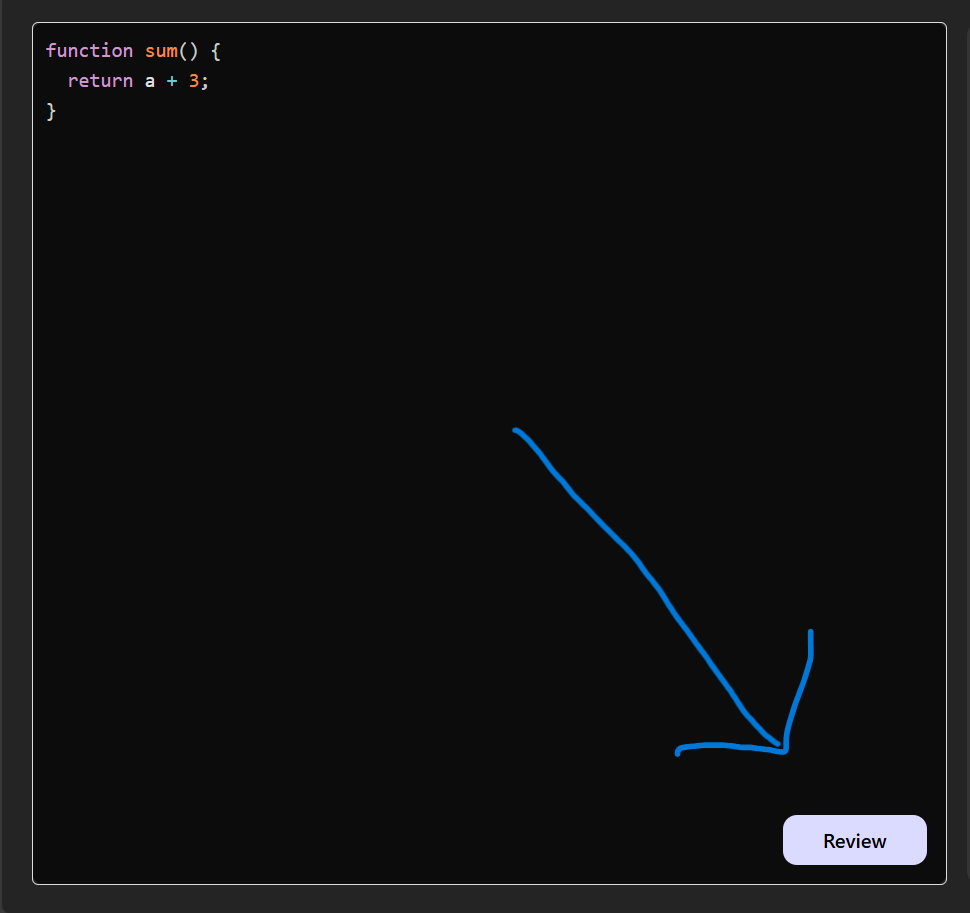

# 🧠 AI AutoCodeReview

**AI AutoCodeReview** is a smart, full-stack web application that automates code reviews using **Google Generative AI (Gemini/PaLM)**. It helps developers and learners receive immediate, structured feedback on their code, improving quality, consistency, and adherence to best practices.

---

## 🚀 Features

- 🤖 **AI-Powered Code Review**  
  Instantly analyzes code and provides intelligent suggestions using Google Generative AI.

- ⚡ **Real-Time Feedback**  
  Submit code and get instant AI-generated reviews via POST requests.

- 🎨 **Syntax Highlighting**  
  Code is displayed with clean, colorful formatting using **PrismJS**.

- 📝 **Markdown Rendering**  
  Feedback is shown in a clean, structured format using **React Markdown**.

- 🔧 **Modular Full-Stack Architecture**  
  Built with a clean separation between frontend and backend for scalability.

---

## 🧰 Tech Stack

### 🔹 Frontend
- React.js (Vite) – Fast, modern frontend setup
- PrismJS – Beautiful syntax highlighting
- React Markdown – Render formatted AI feedback
- Axios – For HTTP requests

### 🔹 Backend
- Node.js & Express.js – Efficient REST API backend
- Google Generative AI (PaLM/Gemini) – Natural language processing & code understanding

---

## 📸 Screenshots

### 🖥️ 1. Home Interface – Code Input and Review Layout

The user lands on a modern interface split into two main sections:
- **Left Panel** – Code input area with syntax highlighting  
- **Right Panel** – Output area showing AI-reviewed feedback, issues, suggestions, and improvements.


---

### ✏️ 2. Code Input Section
User enters or pastes their code in a text area with syntax highlighting.


---

### 🖱️ 3. Click "Review" Button
User clicks the "Review" button to submit code for AI evaluation.



---

### 📤 4. AI-Generated Feedback Output
AI responds with clean, Markdown-formatted suggestions and improvements.


---

## ✍️ Input & Output Details

### ✅ Input
Users can submit code snippets in any language through the input field. The code is sent to the backend via a POST request.

### Example Code:

```javascript
function sum(a, b) {
  return a + b;
}
